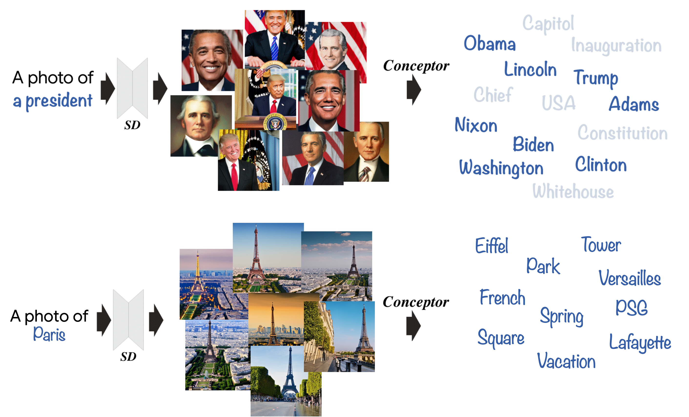

# The Hidden Language of Diffusion Models

<p align="center">
 

<a href="https://hila-chefer.github.io/Conceptor/"></a> 
 <a href="https://arxiv.org/abs/2306.00966"></a>

> Recent text-to-image generative models have demonstrated an unparalleled ability to generate diverse and creative imagery guided by a target text prompt. While revolutionary, current state-of-the-art diffusion models may still fail in generating images that fully convey the semantics in the given text prompt. We analyze the publicly available Stable Diffusion model and assess the existence of catastrophic neglect, where the model fails to generate one or more of the subjects from the input prompt. Moreover, we find that in some cases the model also fails to correctly bind attributes (e.g., colors) to their corresponding subjects. To help mitigate these failure cases, we introduce the concept of Generative Semantic Nursing (GSN), where we seek to intervene in the generative process on the fly during inference time to improve the faithfulness of the generated images. Using an attention-based formulation of GSN, dubbed Attend-and-Excite, we guide the model to refine the cross-attention units to attend to all subject tokens in the text prompt and strengthen — or excite — their activations, encouraging the model to generate all subjects described in the text prompt. We compare our approach to alternative approaches and demonstrate that it conveys the desired concepts more faithfully across a range of text prompts.

## Description  
Official implementation of The Hidden Language of Diffusion Models. 
 <br>
 <b>Code coming soon!</b>

## Concept Explanation with Conceptor
<p align="center">
  
<br>
Given a concept of interest (e.g., a president) and a text-to-image model, we generate a set of images to visually represent the concept. Conceptor then learns to decompose the concept into a small set of interpretable tokens, with the objective of reconstructing the generated images. The decomposition reveals interesting behaviors such as reliance on exemplars (e.g., "Obama", "Biden").
</p>

## Single-image Decomposition with Conceptor
<p align="center">
  
<br>
 Given a single image from the concept, our method extracts the tokens in the decomposition that caused the generation of the image. For example, a snail is decomposed into a combination of ladybug and winding due to the structure of its body, and the texture of its shell.
</p>

## Concept Manipulation with Conceptor
<p align="center">
  
<br>
 Our method enables fine-grained concept manipulation by modifying the coefficient corresponding to a token of interest. For example, by manipulating the coefficient corresponding to the token abstract in the decomposition of the concept sculpture, we can make an input sculpture more or less abstract.
</p>

## Citing our paper
If you make use of our work, please cite our paper:
```
@misc{chefer2023hidden,
    Author = {Hila Chefer and Oran Lang and Mor Geva and Volodymyr Polosukhin and Assaf Shocher and Michal Irani and Inbar Mosseri and Lior Wolf},
    Title = {The Hidden Language of Diffusion Models},
    Year = {2023},
    Eprint = {arXiv:2306.00966},
}
```
