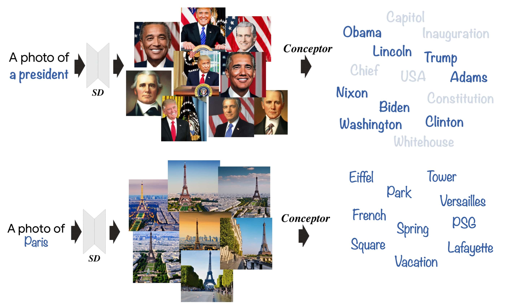
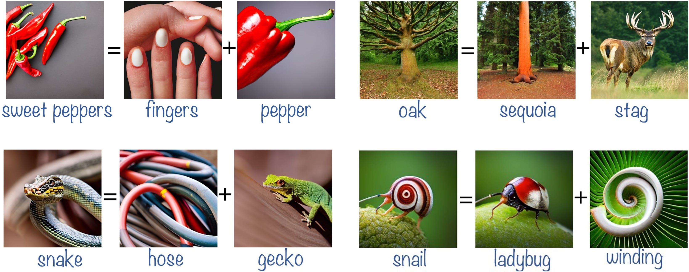
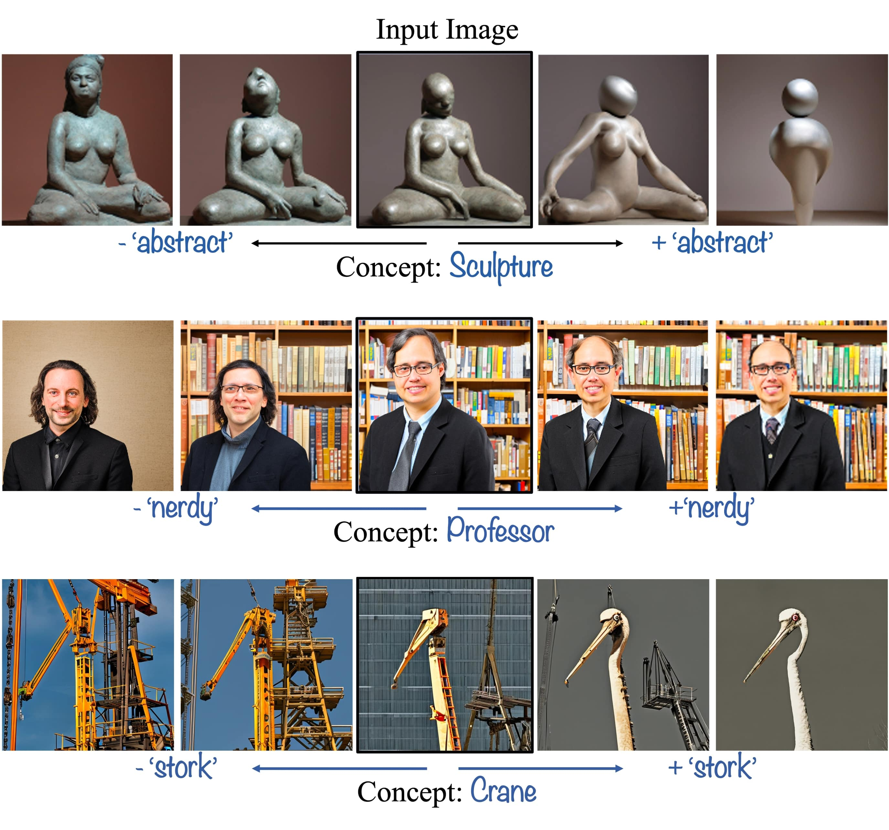

# The Hidden Language of Diffusion Models

<p align="center">
 

<a href="https://hila-chefer.github.io/Conceptor/"></a> 
 <a href="https://arxiv.org/abs/2306.00966"></a>

> Text-to-image diffusion models have demonstrated an unparalleled ability to generate high-quality, diverse images from a textual concept (e.g., "a doctor", "love"). However, the internal process of mapping text to a rich visual representation remains an enigma. In this work, we tackle the challenge of understanding concept representations in text-to-image models by decomposing an input text prompt into a small set of interpretable elements. This is achieved by learning a pseudo-token that is a sparse weighted combination of tokens from the model's vocabulary, with the objective of reconstructing the images generated for the given concept. Applied over the state-of-the-art Stable Diffusion model, this decomposition reveals non-trivial and surprising structures in the representations of concepts. For example, we find that some concepts such as "a president" or "a composer" are dominated by specific instances (e.g., "Obama", "Biden") and their interpolations. Other concepts, such as "happiness" combine associated terms that can be concrete ("family", "laughter") or abstract ("friendship", "emotion"). In addition to peering into the inner workings of Stable Diffusion, our method also enables applications such as single-image decomposition to tokens, bias detection and mitigation, and semantic image manipulation.

### NEW! code is published under the [google research repo](https://github.com/google-research/google-research/tree/a2a0ec853e8fae38532c727799863e9d639aa0f2/conceptor)

## Description  
Official implementation of the paper The Hidden Language of Diffusion Models. The paper proposes a method dubbed <i>Conceptor</i> to produce explanations for text-to-image diffusion models.
 <br>
 <b>Code coming soon!</b>

## Concept Explanation with Conceptor
<p align="center">
  
<br>
Given a concept of interest (e.g., a president) and a text-to-image model, we generate a set of images to visually represent the concept. Conceptor then learns to decompose the concept into a small set of interpretable tokens, with the objective of reconstructing the generated images. The decomposition reveals interesting behaviors such as reliance on exemplars (e.g., "Obama", "Biden").
</p>

## Single-image Decomposition with Conceptor
<p align="center">
  
<br>
 Given a single image from the concept, our method extracts the tokens in the decomposition that caused the generation of the image. For example, a snail is decomposed into a combination of ladybug and winding due to the structure of its body, and the texture of its shell.
</p>

## Concept Manipulation with Conceptor
<p align="center">
  
<br>
 Our method enables fine-grained concept manipulation by modifying the coefficient corresponding to a token of interest. For example, by manipulating the coefficient corresponding to the token abstract in the decomposition of the concept sculpture, we can make an input sculpture more or less abstract.
</p>

## Citing our paper
If you make use of our work, please cite our paper:
```
@article{chefer2023hidden,
        title={The Hidden Language of Diffusion Models},
        author={Chefer, Hila and Lang, Oran and Geva, Mor and Polosukhin, Volodymyr and Shocher, Assaf and Irani, Michal and Mosseri, Inbar and Wolf, Lior},
        journal={arXiv preprint arXiv:2306.00966},
        year={2023}
}
```
